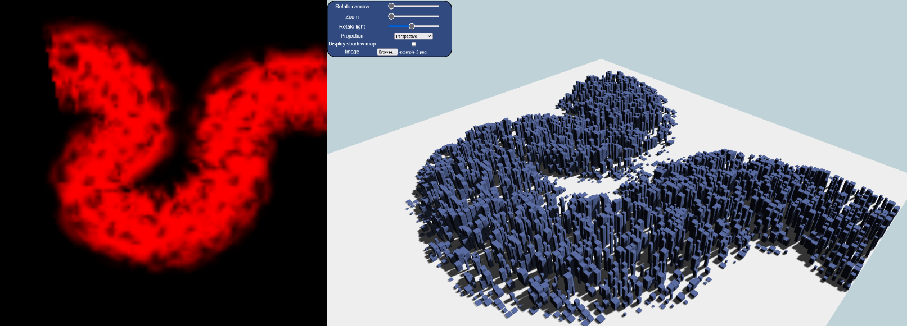
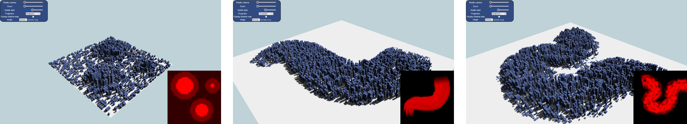

# CS425 - Computer Graphics I (Spring 2022)

## Assignment 4: Geometries from images
The goal of this assignment is to implement a function to create geometries based on an input PNG image that describes the height of buildings. Your application should receive a PNG image and, for each pixel of the image, create a geometry with height determined by the color of the pixel. In other words, a pixel with RGBA value (255,0,0,0) will generate a taller building than pixel with RGBA value (120,0,0,0).

For example, loading the image on the left should result in geometries similar to the one on the right:

There are three tasks (plus an optional one), and you are free to use the skeleton code provided. The code has some comments detailing what needs to be implemented in each function; it contains functions to handle file upload, and user interactions through the control panel, very similar to assignments 1 and 2.

File `utils.js` contains some useful functions to [shaders](https://developer.mozilla.org/en-US/docs/Web/API/WebGLShader), [programs](https://developer.mozilla.org/en-US/docs/Web/API/WebGLProgram), [buffers](https://developer.mozilla.org/en-US/docs/Web/API/WebGLBuffer), [VAOs](https://developer.mozilla.org/en-US/docs/Web/API/WebGLVertexArrayObject), as well as [matrix operations](https://developer.mozilla.org/en-US/docs/Web/API/WebGL_API/Matrix_math_for_the_web), [projections](http://www.songho.ca/opengl/gl_projectionmatrix.html), and [lookat](https://www.khronos.org/registry/OpenGL-Refpages/gl2.1/xhtml/gluLookAt.xml).

Here is an example of assignment 4 loading different image files (bottom right):

### Tasks

#### Task 1
Implement the `buildGeometries` and `createBuilding` in the `gl.js` file. The first function receives as a parameter the array of pixels from an image file (loaded by the user); you should loop through this array and, for each `(x,y)` position, create a new building by calling `createBuilding`. Pay attention that the array is a linear one, yet the image is a 2D image, and you should properly handle this conversation. There are three images in this repository (example-1.png, example-2.png, example-3.png) that you can use to generate the geometries, but you are free to create your own.

#### Task 2
Compute the normals for each vertex of the buildings, and shade the buildings accordingly.

#### Task 3
Use `Math.random` (or similar function) to add noise to both the height and size of the buildings. Note that `Math.random` returns a value between 0 and 1 -- you should properly scale this value so that it matches the scale of the buildings.

#### Task 4 (Optional)
You should implement (or port) the shadow map functionalities from assignment 2.

### Submission
The delivery of the assignments will be done using GitHub Classes. It will not be necessary to use any external JavaScript library for your assignments. If you do find the need to use additional libraries, please send us an email or Discord message to get approval. Your assignment should contain at least the following files:
- index.html: the main HTML file.
- gl.js: assignment main source code.
- \*.vert.js: vertex shaders.
- \*.frag.js: fragment shaders.

### Grading
The code will be evaluated on Firefox. Your submission will be graded according to the quality of the image results, interactions, and correctness of the implemented algorithms.

To get a C on the assignment, your application should be able to load an image file in the format specified above, create the building geometries and visualize them (without normals or shading). To get a B on the assignment, you should compute the normals and use that information to shade the buildings. To get an A, you must add some noise to the size of the buildings. Task 4 is optional (10%).

